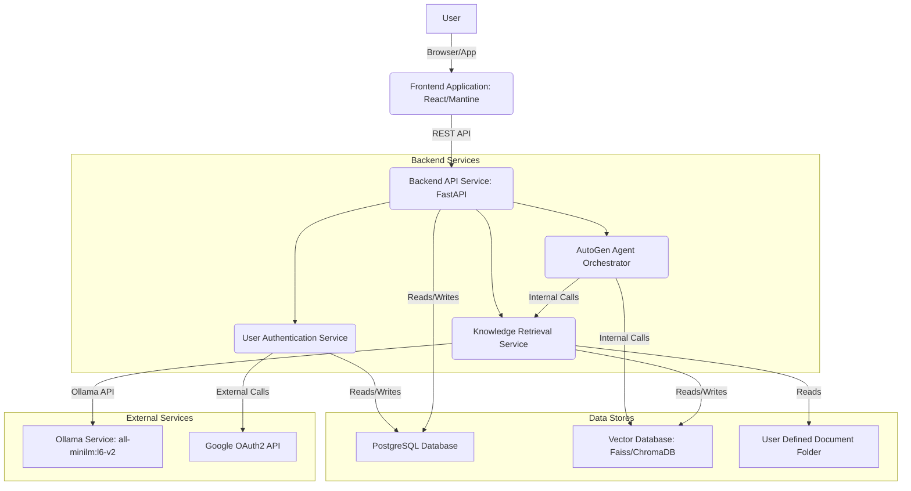

# Components

根據高層次架構、技術堆棧和數據模型，本節識別了 `智能助理應用程式` 中的主要邏輯組件/服務，並定義了它們的職責、接口和依賴關係。

### Component List

#### Frontend Application (Web)

  * **Responsibility**: 提供使用者介面和使用者互動邏輯，包括 Chatbot 介面、歷史聊天區、文件路徑設定和登入/註冊畫面。
  * **Key Interfaces**:
      * HTTP/RESTful API calls to Backend API Service.
      * UI events/interactions.
  * **Dependencies**: Backend API Service, Mantine UI Library, Zustand State Management.
  * **Technology Stack**: React 18, Mantine 7, TypeScript, Zustand.

#### Backend API Service (FastAPI)

  * **Responsibility**: 作為前後端通訊的橋樑，處理來自前端的請求，協調 AutoGen 代理人對話，管理使用者資料和知識庫，並與外部服務（Ollama）及資料庫互動。
  * **Key Interfaces**:
      * RESTful API endpoints (e.g., `/auth/login`, `/auth/register`, `/chat/message`, `/knowledge-base/upload`).
      * Internal API calls to AutoGen Agent Orchestrator.
      * Database connections (PostgreSQL, VectorDB).
      * Ollama API calls.
  * **Dependencies**: Frontend Application, AutoGen Agent Orchestrator, Database Service, Vector Database Service, Ollama Service, User Defined Document Folder.
  * **Technology Stack**: Python 3.10+, FastAPI, Uvicorn, SQLAlchemy, AutoGen.

#### AutoGen Agent Orchestrator (within Backend)

  * **Responsibility**: 在後端服務內部協調和管理所有 AutoGen 代理人，執行多代理對話流程，並根據任務分派呼叫工具。
  * **Key Interfaces**:
      * Internal Python function calls from Backend API Service.
      * Calls to internal tools (e.g., knowledge retrieval, task execution).
  * **Dependencies**: Backend API Service, Knowledge Retrieval Tool, Task Execution Tool (Optional), Feedback & Learning Agent (Optional).
  * **Technology Stack**: AutoGen, Python.

#### Knowledge Retrieval Service (within Backend)

  * **Responsibility**: 處理文件內容的讀取、分塊、Embedding 和儲存到向量資料庫，以及從向量資料庫中檢索相關知識。
  * **Key Interfaces**:
      * Internal API calls from Backend API Service (for upload/processing).
      * Internal function calls from AutoGen Agent Orchestrator (for retrieval tool).
      * Ollama API calls.
      * Vector Database connections.
  * **Dependencies**: Backend API Service, Ollama Service, Vector Database Service, User Defined Document Folder.
  * **Technology Stack**: Python, LangChain/LlamaIndex (或其他分塊/讀取庫), Faiss/ChromaDB (client/SDK).

#### User Authentication Service (within Backend)

  * **Responsibility**: 處理使用者的註冊、登入、密碼加密、會話管理以及 Google 第三方登入的驗證和授權。
  * **Key Interfaces**:
      * Internal API calls from Backend API Service (for auth endpoints).
      * External API calls to Google OAuth2.
      * Database connection (PostgreSQL for user data).
  * **Dependencies**: Backend API Service, PostgreSQL Database, Google OAuth2 API.
  * **Technology Stack**: Python, FastAPI, Passlib (for password hashing), `requests-oauthlib` (或其他 OAuth 庫).

#### Database Service (PostgreSQL)

  * **Responsibility**: 儲存應用程式的結構化數據，如使用者資訊、聊天會話、訊息歷史和知識庫元數據。
  * **Key Interfaces**:
      * SQL connections from Backend API Service, User Authentication Service, Knowledge Retrieval Service.
  * **Dependencies**: Backend API Service, User Authentication Service, Knowledge Retrieval Service.
  * **Technology Stack**: PostgreSQL.

#### Vector Database Service (Faiss/ChromaDB)

  * **Responsibility**: 儲存經過 Ollama Embedding 模型處理後的文件內容向量，並提供高效的相似性搜索能力。
  * **Key Interfaces**:
      * API/SDK calls from Knowledge Retrieval Service.
  * **Dependencies**: Knowledge Retrieval Service.
  * **Technology Stack**: Faiss (本地庫) 或 ChromaDB (可嵌入或客戶端/伺服器模式)。

#### Ollama Service

  * **Responsibility**: 提供 `all-minilm:l6-v2` Embedding 模型服務，用於將文本內容轉換為向量。
  * **Key Interfaces**:
      * HTTP API calls from Knowledge Retrieval Service.
  * **Dependencies**: Knowledge Retrieval Service.
  * **Technology Stack**: Ollama.

### Component Diagrams


