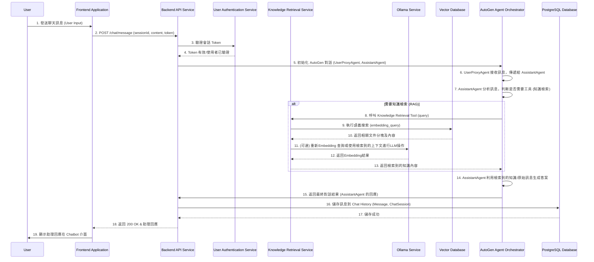
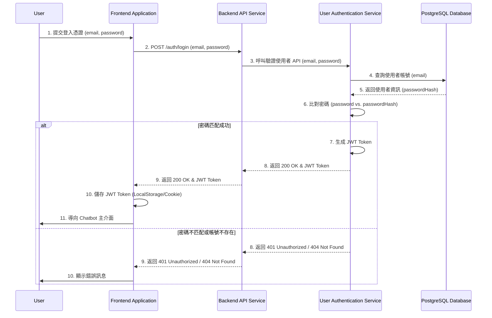

# Core Workflows

### User Message with Knowledge Retrieval Flow

本序列圖說明了使用者在 Chatbot 介面發送訊息後，系統如何觸發知識檢索並協調 AutoGen 代理人生成回應的流程。

```mermaid
sequenceDiagram
    participant User
    participant FrontendApp as Frontend Application
    participant BackendAPI as Backend API Service
    participant AuthSrv as User Authentication Service
    participant KBSrv as Knowledge Retrieval Service
    participant Ollama as Ollama Service
    participant VectorDB as Vector Database
    participant AutoGenOrch as AutoGen Agent Orchestrator
    participant PGDB as PostgreSQL Database

    User->>FrontendApp: 1. 發送聊天訊息 (User Input)
    FrontendApp->>BackendAPI: 2. POST /chat/message (sessionId, content, token)
    BackendAPI->>AuthSrv: 3. 驗證會話 Token
    AuthSrv-->>BackendAPI: 4. Token 有效/使用者已驗證
    BackendAPI->>AutoGenOrch: 5. 初始化 AutoGen 對話 (UserProxyAgent, AssistantAgent)
    AutoGenOrch->>AutoGenOrch: 6. UserProxyAgent 接收訊息，傳遞給 AssistantAgent
    AutoGenOrch->>AutoGenOrch: 7. AssistantAgent 分析訊息，判斷是否需要工具 (知識檢索)
    alt 需要知識檢索 (RAG)
        AutoGenOrch->>KBSrv: 8. 呼叫 Knowledge Retrieval Tool (query)
        KBSrv->>VectorDB: 9. 執行語義搜索 (embedding_query)
        VectorDB-->>KBSrv: 10. 返回相關文件分塊及內容
        KBSrv->>Ollama: 11. (可選) 重新Embedding 查詢或使用檢索到的上下文進行LLM操作
        Ollama-->>KBSrv: 12. 返回Embedding結果
        KBSrv-->>AutoGenOrch: 13. 返回檢索到的知識內容
    end
    AutoGenOrch->>AutoGenOrch: 14. AssistantAgent 利用檢索到的知識/原始訊息生成答案
    AutoGenOrch->>BackendAPI: 15. 返回最終對話結果 (AssistantAgent 的回應)
    BackendAPI->>PGDB: 16. 儲存訊息到 Chat History (Message, ChatSession)
    PGDB-->>BackendAPI: 17. 儲存成功
    BackendAPI-->>FrontendApp: 18. 返回 200 OK & 助理回應
    FrontendApp->>User: 19. 顯示助理回應在 Chatbot 介面

```

### User Login Flow (Local Account)

本序列圖說明了使用者透過本地帳號登入應用程式的流程。

```mermaid
sequenceDiagram
    participant User
    participant FrontendApp as Frontend Application
    participant BackendAPI as Backend API Service
    participant AuthSrv as User Authentication Service
    participant PGDB as PostgreSQL Database

    User->>FrontendApp: 1. 提交登入憑證 (email, password)
    FrontendApp->>BackendAPI: 2. POST /auth/login (email, password)
    BackendAPI->>AuthSrv: 3. 呼叫驗證使用者 API (email, password)
    AuthSrv->>PGDB: 4. 查詢使用者帳號 (email)
    PGDB-->>AuthSrv: 5. 返回使用者資訊 (passwordHash)
    AuthSrv->>AuthSrv: 6. 比對密碼 (password vs. passwordHash)
    alt 密碼匹配成功
        AuthSrv->>AuthSrv: 7. 生成 JWT Token
        AuthSrv-->>BackendAPI: 8. 返回 200 OK & JWT Token
        BackendAPI-->>FrontendApp: 9. 返回 200 OK & JWT Token
        FrontendApp->>FrontendApp: 10. 儲存 JWT Token (LocalStorage/Cookie)
        FrontendApp->>User: 11. 導向 Chatbot 主介面
    else 密碼不匹配或帳號不存在
        AuthSrv-->>BackendAPI: 8. 返回 401 Unauthorized / 404 Not Found
        BackendAPI-->>FrontendApp: 9. 返回 401 Unauthorized / 404 Not Found
        FrontendApp->>User: 10. 顯示錯誤訊息
    end
```

