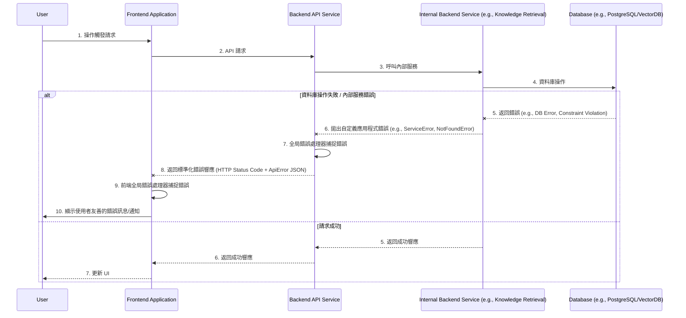

# Error Handling Strategy

### Error Flow

本序列圖說明了應用程式中統一的錯誤處理流程，從後端服務內部錯誤到前端顯示的過程。



### Error Response Format

所有後端 API 響應的錯誤都將遵循統一的 JSON 格式，以便前端能夠一致地處理和顯示錯誤訊息。

```typescript
interface ApiError {
  error: {
    code: string;       // 內部錯誤碼 (例如 "KB_NOT_FOUND", "AUTH_FAILED", "VALIDATION_ERROR")
    message: string;    // 使用者友善的錯誤訊息
    details?: Record<string, any>; // 額外詳細資訊，例如驗證錯誤時的字段錯誤列表
    timestamp: string;  // 錯誤發生時間 (ISO 8601 格式)
    requestId: string;  // 請求 ID (用於日誌追蹤)
  };
}
```

### Frontend Error Handling

前端將實作全局錯誤處理機制，以捕獲 API 錯誤和其他前端運行時錯誤，並向使用者提供一致的回饋。

```typescript
// apps/frontend/src/services/api.ts 或 src/utils/errorHandler.ts
// 假設有一個 API 客戶端或攔截器
import axios from 'axios';
import { ApiError } from 'shared-types'; // 從共享型別導入

const apiClient = axios.create({
  baseURL: import.meta.env.REACT_APP_BACKEND_API_URL,
});

apiClient.interceptors.response.use(
  (response) => response,
  (error) => {
    if (error.response) {
      // 後端返回的標準化錯誤響應
      const apiError: ApiError = error.response.data;
      console.error('API Error:', apiError.error.code, apiError.error.message, apiError.error.details);
      // 可以觸發全局通知或狀態更新
      // displayToast(apiError.error.message, 'error');
    } else if (error.request) {
      // 請求發出但沒有收到響應 (例如網路問題)
      console.error('Network Error:', error.message);
      // displayToast('網路錯誤，請檢查您的連線', 'error');
    } else {
      // 請求設置時發生的錯誤
      console.error('Request Error:', error.message);
      // displayToast('應用程式發生未知錯誤', 'error');
    }
    return Promise.reject(error);
  }
);

// 特定組件中的錯誤處理 (例如表單提交)
// try {
//   await apiClient.post('/some/endpoint', data);
//   // success
// } catch (error) {
//   if (axios.isAxiosError(error) && error.response?.data) {
//     const apiError: ApiError = error.response.data;
//     // 處理特定的錯誤碼或顯示訊息
//   }
// }
```

### Backend Error Handling

後端將實作中央錯誤處理器和自定義異常，以確保所有錯誤都能被適當地捕獲、日誌記錄和標準化響應。

```typescript
