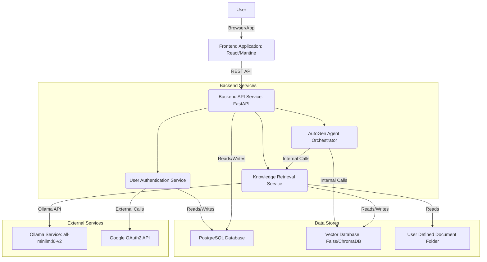
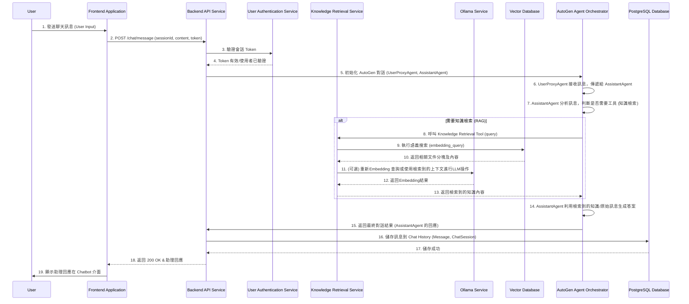
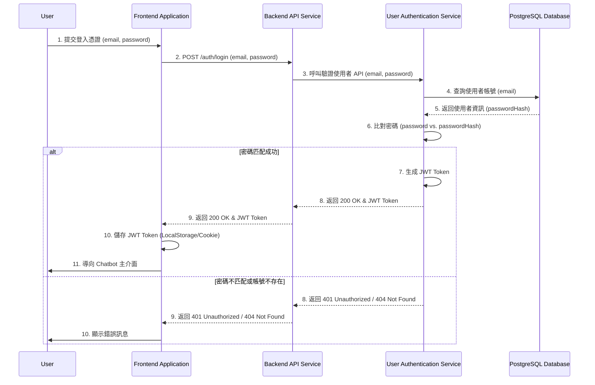
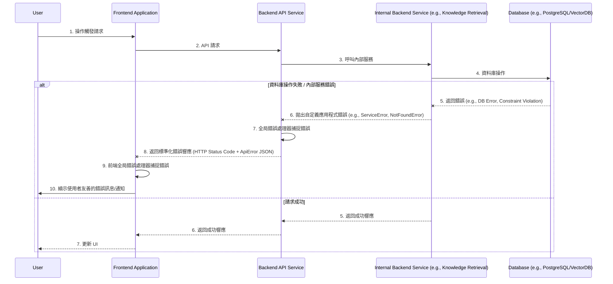

````markdown
# 智能助理應用程式全端架構文件

## Introduction

### Intro Content

本文件概述了 `智能助理應用程式` 的完整全端架構，包括後端系統、前端實作及其整合。它將作為 AI 驅動開發的單一真實來源，確保整個技術堆棧的一致性。這種統一的方法結合了傳統上獨立的後端和前端架構文件，簡化了現代全端應用程式的開發流程，因為這些關注點日益交織在一起。本文件旨在為 Architect 提供指導，確保設計出的系統能夠支援 PRD 中定義的所有功能和非功能性需求，特別是整合 Ollama Embedding 模型、Docker Compose 部署以及使用者登入功能。

### Starter Template or Existing Project

在 PRD 和專案簡報中，並未明確提到要基於現有的前端或全端 Starter Template。因此，我們將從頭開始設計架構，並將所有工具、打包和配置都納入考量。這也意味著我們將完全依據您的技術偏好和專案需求來構建基礎，並考量 Docker Compose 的部署方式。

### Change Log

| Date | Version | Description | Author |
|------|---------|-------------|--------|
| 2025-07-30 | 1.0 | Initial draft based on PRD and Project Brief | Winston (Architect) |

## High Level Architecture

### Technical Summary

此系統將採用**混合式微服務與單體式架構**，結合 React/Mantine 前端與 FastAPI/AutoGen 後端，並利用 **Docker Compose** 進行容器化部署。核心 Chatbot 與 AutoGen 代理人作為單一服務運作，而文件處理與 Embedding 則可獨立擴展。資料模型將統一管理，並透過 RESTful API 進行前後端通訊。整個架構旨在支援 PRD 的目標，提供高效、可擴展且具備知識檢索能力的智能助理應用程式。

### Platform and Infrastructure Choice

根據 PRD 的需求，此專案將專注於 **Web 響應式應用程式**，並預計使用 **Docker Compose** 進行本地開發和初期部署。

**平台推薦：Docker Compose + 本地部署**

* **優點**：
    * **快速開發與環境一致性**：Docker Compose 能夠快速啟動包含前後端服務的開發環境，確保團隊成員環境一致。
    * **輕量級部署**：對於 MVP 階段，Docker Compose 提供了簡單高效的部署方式，無需複雜的雲端資源配置。
    * **可移植性**：基於 Docker 容器，應用程式可以在任何支援 Docker 的環境中運行。
    * **成本效益**：初期無雲端服務費用，降低開發成本。
* **缺點**：
    * **擴展性限制**：Docker Compose 不適合生產環境的大規模水平擴展。
    * **高可用性限制**：需要額外的工具和策略來實現高可用性。

**選定平台：Docker Compose**

* **關鍵服務**：Docker Daemon, Docker Compose。
* **部署主機與區域**：本地開發環境 (Local Development Environment)。

### Repository Structure

* **結構**：**Monorepo (單一儲存庫)**。
* **Monorepo 工具**：考慮使用 `npm workspaces` 或 `pnpm workspaces` 進行簡單的套件管理，以統一管理前後端專案。若未來專案規模擴大，可升級至 `Nx` 或 `Turborepo`。
* **套件組織策略**：
    * `apps/`: 包含獨立的應用程式，如 `apps/frontend` (React app) 和 `apps/backend` (FastAPI app)。
    * `packages/`: 包含可共享的程式碼，如 `packages/shared-types` (前後端共享的 TypeScript 類型定義)、`packages/ui-components` (共享的 Mantine/React 組件)。

### High Level Architecture Diagram

```mermaid
graph TD
    User -->|HTTP/HTTPS| Frontend[Frontend: React/Mantine]
    Frontend -->|RESTful API| Backend[Backend: FastAPI/AutoGen]
    Backend -->|Local FS Access| DocumentFolder[User Defined Document Folder]
    Backend -->|Ollama API| OllamaService[Ollama Service: all-minilm:l6-v2]
    Backend -->|DB Connection| PostgreSQL[PostgreSQL DB: User Data/Chat History]
    Backend -->|Vector DB Connection| VectorDB[Vector Database: Faiss/ChromaDB]

    subgraph Containerized Deployment (Docker Compose)
        Frontend
        Backend
        OllamaService
        PostgreSQL
        VectorDB
    end

    subgraph AutoGen Multi-Agent System (within Backend)
        Backend --> UserProxyAgent[User Proxy Agent]
        UserProxyAgent --> QueryUnderstandingAgent[Query Understanding Agent]
        QueryUnderstandingAgent --> KnowledgeRetrievalAgent[Knowledge Retrieval Agent]
        KnowledgeRetrievalAgent --> AnswerGenerationAgent[Answer Generation Agent]
        AnswerGenerationAgent --> TaskExecutionAgent(Task Execution Agent - Optional)
        AnswerGenerationAgent --> FeedbackLearningAgent(Feedback & Learning Agent - Optional)
        KnowledgeRetrievalAgent --> VectorDB
    end
````

### Architectural Patterns

  * **全端架構**：
      * **推薦**：**混合式架構 (Hybrid Monolith/Microservices)**。
          * **理由**：核心 Chatbot 和 AutoGen 代理人可作為單一服務啟動，簡化初期開發。文件處理和 Embedding 則可獨立擴展，為未來高併發處理文件預留彈性。
  * **前端模式**：
      * **Component-Based UI (組件化 UI)**：使用 React 組件化開發，提高可重用性和維護性。
      * **State Management (狀態管理)**：採用 Zustand 進行輕量級全局狀態管理。
  * **後端模式**：
      * **Repository Pattern (儲存庫模式)**：抽象化數據存取邏輯，提高可測試性和未來資料庫遷移的靈活性。
      * **推薦**：**基於 FastAPI 的 RESTful API 設計**。
          * **理由**：FastAPI 提供高性能的非同步 API 開發，內建 Pydantic 用於數據驗證，非常適合構建 RESTful 服務。
  * **整合模式**：
      * **推薦**：**直接 RESTful API 通訊**。
          * **理由**：MVP 階段前後端直接透過標準 RESTful API 進行通訊，簡化複雜性，符合快速開發原則。

## Tech Stack

以下是 `智能助理應用程式` 的最終技術堆棧選型。這份表格將作為所有開發工作的單一真實來源，所有團隊成員必須依據此處定義的確切版本進行開發。

**關鍵決策總結**:

  * **平台**：Docker Compose (用於容器化部署)。
  * **Embedding 服務**：Ollama (`http://ollama.webtw.xyz:11434` )。
  * **Embedding 模型**：`all-minilm:l6-v2`。

| Category | Technology | Version | Purpose | Rationale |
| :------------------ | :--------- | :-------- | :-------- | :-------- |
| Frontend Language | TypeScript | 5.x | 主要前端開發語言 | 強型別、提升程式碼品質與可維護性。 |
| Frontend Framework | React | 18.x | 核心前端框架 | 業界廣泛採用，組件化開發，擁有龐大生態系。 |
| UI Component Library | Mantine | 7.x | UI 組件庫 | 提供豐富、可客製化的組件，加速 UI 開發，與 React 良好整合。 |
| State Management | Zustand | ^4.0.0 | 前端狀態管理 | 輕量級、易於使用、高效的 React 狀態管理庫。 |
| Backend Language | Python | 3.10+ | 主要後端開發語言 | 適用於 AI/ML 相關應用，擁有豐富的函式庫。 |
| Backend Framework | FastAPI | ^0.111.0 | 後端 API 框架 | 高性能、易於學習、內建 Pydantic 資料驗證，與 AutoGen 兼容。 |
| AI Agent Framework | AutoGen | ^0.2.0 | 多代理智能體框架 | 提供多代理協同對話和任務執行能力。 |
| API Style | REST | 1.0 | 前後端 API 風格 | 標準化、廣泛支持，易於理解和實作。 |
| Database | PostgreSQL | 16.x | 關係型資料庫 | 穩定、可靠、功能強大，適用於使用者資料、聊天歷史等結構化數據。 |
| Cache | Redis | 7.x | 緩存系統 | 高性能 Key-Value 存儲，適用於會話管理、API 響應緩存等。 |
| File Storage | 本地文件系統 | N/A | 儲存使用者文件 | 使用者自訂資料夾路徑，由後端直接存取。 |
| Authentication | OAuth2 / JWT | N/A | 身份驗證與授權 | 支援 Google 登入和本地登入，提供安全的 API 訪問。 |
| Frontend Testing | Jest | ^29.0.0 | 前端單元/整合測試 | 廣泛使用的 JavaScript 測試框架，適合 React 組件測試。 |
| Backend Testing | Pytest | ^8.0.0 | 後端單元/整合測試 | Python 測試框架，簡潔高效。 |
| E2E Testing | Playwright | ^1.40.0 | 端對端測試 | 支援多瀏覽器，提供可靠的端對端測試。 |
| Build Tool | Webpack / Vite | N/A | 前端打包工具 | Vite 更快，Webpack 更靈活，根據具體專案結構和需求決定。 |
| Bundler | Docker Compose | 2.x | 多容器應用程式管理工具 | 簡化前後端及相關服務的本地開發與部署。 |
| IaC Tool | N/A | N/A | 基礎設施即程式碼 | 初期 MVP 階段不使用，未來擴展至雲端部署時再考慮。 |
| CI/CD | GitHub Actions | N/A | 持續整合/交付 | 易於整合、自動化測試和部署流程。 |
| Monitoring | Prometheus/Grafana | N/A | 應用程式監控 | 用於監控應用程式的效能指標和系統健康狀況。 |
| Logging | ELK Stack (Elasticsearch, Logstash, Kibana) | N/A | 日誌管理 | 集中式日誌收集、分析和可視化。 |
| CSS Framework | Tailwind CSS | ^3.0.0 | CSS 實用工具框架 | 加速 CSS 開發，提供高度可客製化的響應式設計。 |
| Embedding Service | Ollama | ^0.1.x | 本地 LLM/Embedding 服務 | 運行本地 Embedding 模型，降低成本和數據隱私風險。 |
| Embedding Model | `all-minilm:l6-v2` | N/A | 文件 Embedding 模型 | 輕量級、高效的 Embedding 模型。 |

## Data Models

本節定義了 `智能助理應用程式` 的核心數據模型/實體，這些模型將在前端和後端之間共享。它們基於 PRD 的需求，並包含了關鍵屬性和關係。

### User (使用者)

  * **Purpose**: 儲存應用程式中使用者的基本資訊，包括本地註冊使用者和透過第三方登入的使用者。
  * **Key Attributes**:
      * `id`: `string` - 唯一使用者識別符。
      * `email`: `string` - 使用者的電子郵件地址（唯一）。
      * `passwordHash`: `string` - 加密過的使用者密碼（僅限本地登入）。
      * `googleId`: `string` - Google 帳號的唯一識別符（僅限 Google 登入）。
      * `name`: `string` - 使用者的名稱。
      * `createdAt`: `Date` - 帳號創建時間。
      * `updatedAt`: `Date` - 帳號最後更新時間。

#### TypeScript Interface

```typescript
interface User {
  id: string;
  email: string;
  passwordHash?: string; // Optional for Google login
  googleId?: string;     // Optional for local login
  name: string;
  createdAt: Date;
  updatedAt: Date;
}
```

#### Relationships

  * 與 `ChatSession` (一對多): 一個使用者可以有多個聊天會話。
  * 與 `KnowledgeBase` (一對多): 一個使用者可以有多個知識庫。

### ChatSession (聊天會話)

  * **Purpose**: 儲存使用者與智能助理之間的單次對話會話記錄。
  * **Key Attributes**:
      * `id`: `string` - 唯一會話識別符。
      * `userId`: `string` - 關聯的使用者 ID。
      * `title`: `string` - 會話標題（可自動生成或使用者編輯）。
      * `createdAt`: `Date` - 會話創建時間。
      * `updatedAt`: `Date` - 會話最後更新時間。

#### TypeScript Interface

```typescript
interface ChatSession {
  id: string;
  userId: string;
  title: string;
  createdAt: Date;
  updatedAt: Date;
}
```

#### Relationships

  * 與 `User` (多對一): 多個聊天會話屬於一個使用者。
  * 與 `Message` (一對多): 一個聊天會話可以有多條訊息。

### Message (訊息)

  * **Purpose**: 儲存單條聊天訊息的內容和發送者。
  * **Key Attributes**:
      * `id`: `string` - 唯一訊息識別符。
      * `sessionId`: `string` - 關聯的聊天會話 ID。
      * `sender`: `'user' | 'assistant' | 'system'` - 訊息發送者。
      * `content`: `string` - 訊息內容。
      * `timestamp`: `Date` - 訊息發送時間。
      * `toolCalls`: `any[]` - AutoGen 代理人呼叫工具的記錄 (如果適用)。
      * `toolOutputs`: `any[]` - AutoGen 工具執行輸出的記錄 (如果適用)。

#### TypeScript Interface

```typescript
interface Message {
  id: string;
  sessionId: string;
  sender: 'user' | 'assistant' | 'system';
  content: string;
  timestamp: Date;
  toolCalls?: any[];   // Optional, for AutoGen tool calls
  toolOutputs?: any[]; // Optional, for AutoGen tool outputs
}
```

#### Relationships

  * 與 `ChatSession` (多對一): 多條訊息屬於一個聊天會話。

### KnowledgeBase (知識庫)

  * **Purpose**: 代表使用者定義的一個文件資料夾，其內容被導入到向量資料庫中。
  * **Key Attributes**:
      * `id`: `string` - 唯一知識庫識別符。
      * `userId`: `string` - 關聯的使用者 ID。
      * `name`: `string` - 知識庫名稱（例如資料夾名稱）。
      * `path`: `string` - 使用者指定的本地文件資料夾路徑。
      * `status`: `'pending' | 'processing' | 'ready' | 'error'` - 導入狀態。
      * `importedAt`: `Date` - 最後導入時間。
      * `documentCount`: `number` - 已導入的文件數量。
      * `errorDetails`: `string` - 導入錯誤的詳細資訊。

#### TypeScript Interface

```typescript
interface KnowledgeBase {
  id: string;
  userId: string;
  name: string;
  path: string;
  status: 'pending' | 'processing' | 'ready' | 'error';
  importedAt: Date;
  documentCount: number;
  errorDetails?: string; // Optional, for error status
}
```

#### Relationships

  * 與 `User` (多對一): 多個知識庫屬於一個使用者。
  * 與 `DocumentChunk` (一對多): 一個知識庫包含多個文件分塊。

### DocumentChunk (文件分塊)

  * **Purpose**: 儲存從原始文件提取並分塊後的內容，以及其對應的 Embedding 向量。這是向量資料庫中的主要數據單元。
  * **Key Attributes**:
      * `id`: `string` - 唯一分塊識別符。
      * `knowledgeBaseId`: `string` - 關聯的知識庫 ID。
      * `documentPath`: `string` - 原始文件在本地的完整路徑。
      * `chunkIndex`: `number` - 該分塊在原始文件中的順序。
      * `content`: `string` - 分塊的文本內容。
      * `embedding`: `number[]` - Ollama `all-minilm:l6-v2` 模型生成的 Embedding 向量。
      * `createdAt`: `Date` - 分塊創建（Embedding 完成）時間。

#### TypeScript Interface

```typescript
interface DocumentChunk {
  id: string;
  knowledgeBaseId: string;
  documentPath: string;
  chunkIndex: number;
  content: string;
  embedding: number[]; // Array of numbers
  createdAt: Date;
}
```

#### Relationships

  * 與 `KnowledgeBase` (多對一): 多個文件分塊屬於一個知識庫。

## Components

根據高層次架構、技術堆棧和數據模型，本節識別了 `智能助理應用程式` 中的主要邏輯組件/服務，並定義了它們的職責、接口和依賴關係。

### Component List

#### Frontend Application (Web)

  * **Responsibility**: 提供使用者介面和使用者互動邏輯，包括 Chatbot 介面、歷史聊天區、文件路徑設定和登入/註冊畫面。
  * **Key Interfaces**:
      * HTTP/RESTful API calls to Backend API Service.
      * UI events/interactions.
  * **Dependencies**: Backend API Service, Mantine UI Library, Zustand State Management.
  * **Technology Stack**: React 18, Mantine 7, TypeScript, Zustand.

#### Backend API Service (FastAPI)

  * **Responsibility**: 作為前後端通訊的橋樑，處理來自前端的請求，協調 AutoGen 代理人對話，管理使用者資料和知識庫，並與外部服務（Ollama）及資料庫互動。
  * **Key Interfaces**:
      * RESTful API endpoints (e.g., `/auth/login`, `/auth/register`, `/chat/message`, `/knowledge-base/upload`).
      * Internal API calls to AutoGen Agent Orchestrator.
      * Database connections (PostgreSQL, VectorDB).
      * Ollama API calls.
  * **Dependencies**: Frontend Application, AutoGen Agent Orchestrator, Database Service, Vector Database Service, Ollama Service, User Defined Document Folder.
  * **Technology Stack**: Python 3.10+, FastAPI, Uvicorn, SQLAlchemy, AutoGen.

#### AutoGen Agent Orchestrator (within Backend)

  * **Responsibility**: 在後端服務內部協調和管理所有 AutoGen 代理人，執行多代理對話流程，並根據任務分派呼叫工具。
  * **Key Interfaces**:
      * Internal Python function calls from Backend API Service.
      * Calls to internal tools (e.g., knowledge retrieval, task execution).
  * **Dependencies**: Backend API Service, Knowledge Retrieval Tool, Task Execution Tool (Optional), Feedback & Learning Agent (Optional).
  * **Technology Stack**: AutoGen, Python.

#### Knowledge Retrieval Service (within Backend)

  * **Responsibility**: 處理文件內容的讀取、分塊、Embedding 和儲存到向量資料庫，以及從向量資料庫中檢索相關知識。
  * **Key Interfaces**:
      * Internal API calls from Backend API Service (for upload/processing).
      * Internal function calls from AutoGen Agent Orchestrator (for retrieval tool).
      * Ollama API calls.
      * Vector Database connections.
  * **Dependencies**: Backend API Service, Ollama Service, Vector Database Service, User Defined Document Folder.
  * **Technology Stack**: Python, LangChain/LlamaIndex (或其他分塊/讀取庫), Faiss/ChromaDB (client/SDK).

#### User Authentication Service (within Backend)

  * **Responsibility**: 處理使用者的註冊、登入、密碼加密、會話管理以及 Google 第三方登入的驗證和授權。
  * **Key Interfaces**:
      * Internal API calls from Backend API Service (for auth endpoints).
      * External API calls to Google OAuth2.
      * Database connection (PostgreSQL for user data).
  * **Dependencies**: Backend API Service, PostgreSQL Database, Google OAuth2 API.
  * **Technology Stack**: Python, FastAPI, Passlib (for password hashing), `requests-oauthlib` (或其他 OAuth 庫).

#### Database Service (PostgreSQL)

  * **Responsibility**: 儲存應用程式的結構化數據，如使用者資訊、聊天會話、訊息歷史和知識庫元數據。
  * **Key Interfaces**:
      * SQL connections from Backend API Service, User Authentication Service, Knowledge Retrieval Service.
  * **Dependencies**: Backend API Service, User Authentication Service, Knowledge Retrieval Service.
  * **Technology Stack**: PostgreSQL.

#### Vector Database Service (Faiss/ChromaDB)

  * **Responsibility**: 儲存經過 Ollama Embedding 模型處理後的文件內容向量，並提供高效的相似性搜索能力。
  * **Key Interfaces**:
      * API/SDK calls from Knowledge Retrieval Service.
  * **Dependencies**: Knowledge Retrieval Service.
  * **Technology Stack**: Faiss (本地庫) 或 ChromaDB (可嵌入或客戶端/伺服器模式)。

#### Ollama Service

  * **Responsibility**: 提供 `all-minilm:l6-v2` Embedding 模型服務，用於將文本內容轉換為向量。
  * **Key Interfaces**:
      * HTTP API calls from Knowledge Retrieval Service.
  * **Dependencies**: Knowledge Retrieval Service.
  * **Technology Stack**: Ollama.

### Component Diagrams



## External APIs

### Google OAuth2 API

  * **Purpose**: 用於實現使用者透過 Google 帳號登入應用程式的功能，提供便捷的第三方身份驗證。
  * **Documentation**: Google Identity Platform - OAuth 2.0 (實際文件 URL 將在實作時獲取最新版本)
  * **Base URL(s)**:
      * 授權端點: `https://accounts.google.com/o/oauth2/v2/auth`
      * Token 端點: `https://oauth2.googleapis.com/token`
      * 使用者資訊端點: `https://www.googleapis.com/oauth2/v3/userinfo` (或 `https://openidconnect.googleapis.com/v1/userinfo` 依需求選擇)
  * **Authentication**: OAuth 2.0 授權碼流程 (Authorization Code Flow)。應用程式將使用 `client_id` 和 `client_secret` 進行身份驗證，並透過回呼 URL 接收授權碼。
  * **Rate Limits**: Google OAuth2 API 有標準的配額限制，通常在數百萬次請求/天，對於 MVP 階段應足夠。
  * **Key Endpoints Used**:
      * `GET https://accounts.google.com/o/oauth2/v2/auth` - 啟動授權流程。
      * `POST https://oauth2.googleapis.com/token` - 交換授權碼為 Access Token 和 ID Token。
      * `GET https://www.googleapis.com/oauth2/v3/userinfo` - 獲取使用者個人資料。
  * **Integration Notes**:
      * 後端負責處理 OAuth 回呼和 Token 交換，確保 `client_secret` 的安全儲存。
      * 前端負責觸發導向 Google 授權頁面，並處理導回。
      * 需處理可能的網路錯誤和授權失敗情況。

## Core Workflows

### User Message with Knowledge Retrieval Flow

本序列圖說明了使用者在 Chatbot 介面發送訊息後，系統如何觸發知識檢索並協調 AutoGen 代理人生成回應的流程。



### User Login Flow (Local Account)

本序列圖說明了使用者透過本地帳號登入應用程式的流程。



## Database Schema

本節將 `智能助理應用程式` 的概念數據模型轉換為具體的 PostgreSQL 數據庫 Schema。這些定義將包含表結構、關鍵屬性、索引、約束和表之間的關係。

```sql
-- 使用者 (User) Table
-- 儲存應用程式中使用者的基本資訊，包括本地註冊使用者和透過第三方登入的使用者。
CREATE TABLE users (
    id UUID PRIMARY KEY DEFAULT gen_random_uuid(),
    email VARCHAR(255) UNIQUE NOT NULL,
    password_hash VARCHAR(255), -- 加密過的使用者密碼（僅限本地登入）
    google_id VARCHAR(255) UNIQUE, -- Google 帳號的唯一識別符（僅限 Google 登入）
    name VARCHAR(255) NOT NULL,
    created_at TIMESTAMP WITH TIME ZONE DEFAULT CURRENT_TIMESTAMP,
    updated_at TIMESTAMP WITH TIME ZONE DEFAULT CURRENT_TIMESTAMP
);

-- 索引，加速查詢
CREATE INDEX idx_users_email ON users (email);
CREATE INDEX idx_users_google_id ON users (google_id);


-- 聊天會話 (ChatSession) Table
-- 儲存使用者與智能助理之間的單次對話會話記錄。
CREATE TABLE chat_sessions (
    id UUID PRIMARY KEY DEFAULT gen_random_uuid(),
    user_id UUID NOT NULL,
    title VARCHAR(255) NOT NULL,
    created_at TIMESTAMP WITH TIME ZONE DEFAULT CURRENT_TIMESTAMP,
    updated_at TIMESTAMP WITH TIME ZONE DEFAULT CURRENT_TIMESTAMP,
    CONSTRAINT fk_user
        FOREIGN KEY(user_id)
        REFERENCES users(id)
        ON DELETE CASCADE
);

-- 索引，加速查詢
CREATE INDEX idx_chat_sessions_user_id ON chat_sessions (user_id);


-- 訊息 (Message) Table
-- 儲存單條聊天訊息的內容和發送者。
CREATE TYPE message_sender_enum AS ENUM ('user', 'assistant', 'system');
CREATE TABLE messages (
    id UUID PRIMARY KEY DEFAULT gen_random_uuid(),
    session_id UUID NOT NULL,
    sender message_sender_enum NOT NULL,
    content TEXT NOT NULL,
    timestamp TIMESTAMP WITH TIME ZONE DEFAULT CURRENT_TIMESTAMP,
    tool_calls JSONB, -- AutoGen 代理人呼叫工具的記錄
    tool_outputs JSONB, -- AutoGen 工具執行輸出的記錄
    CONSTRAINT fk_session
        FOREIGN KEY(session_id)
        REFERENCES chat_sessions(id)
        ON DELETE CASCADE
);

-- 索引，加速查詢
CREATE INDEX idx_messages_session_id ON messages (session_id);
CREATE INDEX idx_messages_timestamp ON messages (timestamp);


-- 知識庫 (KnowledgeBase) Table
-- 代表使用者定義的一個文件資料夾，其內容被導入到向量資料庫中。
CREATE TYPE knowledge_base_status_enum AS ENUM ('pending', 'processing', 'ready', 'error');
CREATE TABLE knowledge_bases (
    id UUID PRIMARY KEY DEFAULT gen_random_uuid(),
    user_id UUID NOT NULL,
    name VARCHAR(255) NOT NULL,
    path TEXT UNIQUE NOT NULL, -- 使用者指定的本地文件資料夾路徑，需要唯一
    status knowledge_base_status_enum NOT NULL DEFAULT 'pending',
    imported_at TIMESTAMP WITH TIME ZONE, -- 最後導入時間
    document_count INTEGER DEFAULT 0, -- 已導入的文件數量
    error_details TEXT, -- 導入錯誤的詳細資訊
    created_at TIMESTAMP WITH TIME ZONE DEFAULT CURRENT_TIMESTAMP,
    updated_at TIMESTAMP WITH TIME ZONE DEFAULT CURRENT_TIMESTAMP,
    CONSTRAINT fk_user_kb
        FOREIGN KEY(user_id)
        REFERENCES users(id)
        ON DELETE CASCADE
);

-- 索引，加速查詢
CREATE INDEX idx_knowledge_bases_user_id ON knowledge_bases (user_id);


-- 文件分塊 (DocumentChunk) Table
-- 儲存從原始文件提取並分塊後的內容，以及其對應的 Embedding 向量。
-- 注意: Embedding 向量本身將主要儲存在向量資料庫中，此處僅作為元數據和引用。
-- 如果 Vector Database 是獨立的 (如 ChromaDB server)，此處可能只儲存向量 ID。
-- 如果 Vector Database 是嵌入式的 (如 Faiss)，則向量本身可能在此處或作為輔助文件儲存。
-- 為了簡潔和示範，假設 `embedding_vector_id` 指向外部向量資料庫中的實際向量。
-- 或者，如果選擇了可以內嵌在 PostgreSQL 的向量擴展，則 `embedding_vector` 可以直接儲存在這裡 (例如 pgvector)。
CREATE TABLE document_chunks (
    id UUID PRIMARY KEY DEFAULT gen_random_uuid(),
    knowledge_base_id UUID NOT NULL,
    document_path TEXT NOT NULL, -- 原始文件在本地的完整路徑
    chunk_index INTEGER NOT NULL, -- 該分塊在原始文件中的順序
    content TEXT NOT NULL, -- 分塊的文本內容
    -- embedding_vector_id UUID, -- 如果向量本身在獨立的向量資料庫，此處存 ID
    -- 或者，如果使用 pgvector 擴展，則為：embedding_vector VECTOR(384),
    -- all-minilm:l6-v2 模型輸出 384 維向量
    created_at TIMESTAMP WITH TIME ZONE DEFAULT CURRENT_TIMESTAMP,
    CONSTRAINT fk_knowledge_base
        FOREIGN KEY(knowledge_base_id)
        REFERENCES knowledge_bases(id)
        ON DELETE CASCADE,
    UNIQUE (knowledge_base_id, document_path, chunk_index) -- 確保每個分塊的唯一性
);

-- 索引，加速查詢
CREATE INDEX idx_document_chunks_knowledge_base_id ON document_chunks (knowledge_base_id);
-- CREATE INDEX idx_document_chunks_embedding_vector_id ON document_chunks (embedding_vector_id);
-- 如果使用 pgvector，則為 CREATE INDEX ON document_chunks USING HNSW (embedding_vector vector_l2_ops);
```

## Source Tree

本節描述了 `智能助理應用程式` 的專案資料夾結構，反映了 Monorepo 的組織方式，並為前後端服務、共享代碼和基礎設施配置提供了清晰的劃分。

```plaintext
smart-assistant-app/
├── .github/                    # CI/CD workflows (e.g., GitHub Actions)
│   └── workflows/
│       ├── ci.yaml
│       └── deploy.yaml
├── apps/                       # Application packages
│   ├── frontend/               # Frontend application (React/Mantine)
│   │   ├── public/             # Static assets
│   │   ├── src/
│   │   │   ├── assets/         # Images, icons, fonts
│   │   │   ├── components/     # Reusable UI components
│   │   │   ├── hooks/          # Custom React hooks
│   │   │   ├── pages/          # Page-level components/routes
│   │   │   ├── services/       # API client services
│   │   │   ├── stores/         # Zustand state management stores
│   │   │   ├── styles/         # Global styles, Mantine theme overrides
│   │   │   └── utils/          # Frontend specific utilities
│   │   ├── tests/              # Frontend tests (Jest, React Testing Library)
│   │   ├── .env.example        # Frontend environment variables
│   │   └── package.json
│   └── backend/                # Backend application (FastAPI/AutoGen)
│       ├── src/
│       │   ├── api/            # FastAPI routers/controllers
│       │   ├── core/           # Core application logic, config
│       │   ├── agents/         # AutoGen agents definitions
│       │   ├── services/       # Business logic services (e.g., UserService, ChatService)
│       │   ├── models/         # Database models (SQLAlchemy)
│   │   │   ├── schemas/        # Pydantic schemas for request/response validation
│   │   │   ├── tools/          # AutoGen callable tools (e.g., knowledge retrieval)
│   │   │   └── database.py     # Database connection and session management
│       ├── tests/              # Backend tests (Pytest)
│       ├── .env.example        # Backend environment variables
│       └── requirements.txt
├── packages/                   # Shared packages
│   ├── shared-types/           # Shared TypeScript interfaces and types
│   │   ├── src/
│   │   │   └── index.ts
│   │   └── package.json
│   ├── ui-components/          # Optional: Shared UI components library
│   │   ├── src/
│   │   └── package.json
│   └── config/                 # Shared configuration files (e.g., ESLint, Prettier, TypeScript)
│       ├── eslint-config/
│       ├── prettier-config/
│       └── tsconfig-bases/
├── infrastructure/             # Infrastructure definitions (e.g., Docker Compose)
│   └── docker-compose.yml      # Docker Compose configuration for dev/prod
├── scripts/                    # Monorepo management scripts (optional, e.g., for `npm workspaces`)
├── docs/                       # Documentation
│   ├── prd.md
│   ├── fullstack-architecture.md
│   └── (other docs like project-brief.md)
├── .env.example                # Root level example environment variables
├── package.json                # Root package.json for monorepo workspaces
└── README.md
└── .gitignore
```

## Development Workflow

### Local Development Setup

本節定義了本地開發環境的設置步驟和常用命令，以確保團隊成員能夠快速且一致地啟動專案。

#### Prerequisites

在開始開發之前，請確保您的系統已安裝以下軟體：

```bash
# Docker Desktop (includes Docker Engine and Docker Compose)
# 下載並安裝您操作系統對應的 Docker Desktop 版本：
# macOS: [https://docs.docker.com/desktop/install/mac-install/](https://docs.docker.com/desktop/install/mac-install/)
# Windows: [https://docs.docker.com/desktop/install/windows-install/](https://docs.docker.com/desktop/install/windows-install/)
# Linux: [https://docs.docker.com/desktop/install/linux-install/](https://docs.docker.com/desktop/install/linux-install/)

# Node.js (v18.x 或更高版本, for frontend development and monorepo tooling)
# 下載並安裝 LTS 版本：
# [https://nodejs.org/en/download/](https://nodejs.org/en/download/)
# 或使用版本管理器 (如 nvm): [https://github.com/nvm-sh/nvm](https://github.com/nvm-sh/nvm)

# Python (v3.10+ 或更高版本, for backend development)
# 下載並安裝：
# [https://www.python.org/downloads/](https://www.python.org/downloads/)
# 或使用版本管理器 (如 pyenv): [https://github.com/pyenv/pyenv](https://github.com/pyenv/pyenv)

# pnpm (推薦用於 monorepo 套件管理)
# npm install -g pnpm
```

#### Initial Setup

首次克隆專案後，請按照以下步驟設置開發環境：

```bash
# 進入專案根目錄
cd smart-assistant-app/

# 安裝 monorepo 根目錄的依賴 (這會同時安裝 apps 和 packages 中的所有依賴)
pnpm install

# 啟動 Docker Compose 服務 (這會建立並啟動所有容器：前端、後端、PostgreSQL, Ollama)
docker compose up -d
```

#### Development Commands

以下是常用的開發命令：

```bash
# Start all services (from infrastructure/ directory or root if docker-compose.yml is there)
# 確保您在包含 docker-compose.yml 的目錄下執行此命令
docker compose up # 這會在前台運行，並顯示日誌
# 或者在後台運行：
# docker compose up -d

# Start frontend only (如果需要獨立啟動前端)
# cd apps/frontend
# pnpm dev

# Start backend only (如果需要獨立啟動後端)
# cd apps/backend
# uvicorn src.main:app --reload

# Run tests
# pnpm test # 運行所有專案的測試 (monorepo root)
# cd apps/frontend && pnpm test # 運行前端測試
# cd apps/backend && pytest # 運行後端測試
```

### Environment Configuration

本節定義了專案所需的環境變數，並說明了其適用的範圍和命名規範。

#### Required Environment Variables

  * **Frontend (.env.local)**: 儲存在 `apps/frontend/.env.local`
    ```bash
    # REACT_APP_BACKEND_API_URL: 後端 API 的 URL
    REACT_APP_BACKEND_API_URL=http://localhost:8000/api
    # REACT_APP_GOOGLE_CLIENT_ID: Google OAuth Client ID
    REACT_APP_GOOGLE_CLIENT_ID=YOUR_GOOGLE_CLIENT_ID
    ```
  * **Backend (.env)**: 儲存在 `apps/backend/.env`
    ```bash
    # DATABASE_URL: PostgreSQL 資料庫連接字串
    DATABASE_URL=postgresql://user:password@db:5432/mydatabase
    # SECRET_KEY: 用於 JWT 簽名的秘密金鑰
    SECRET_KEY=your_super_secret_jwt_key
    # GOOGLE_CLIENT_ID: Google OAuth Client ID
    GOOGLE_CLIENT_ID=YOUR_GOOGLE_CLIENT_ID
    # GOOGLE_CLIENT_SECRET: Google OAuth Client Secret
    GOOGLE_CLIENT_SECRET=YOUR_GOOGLE_CLIENT_SECRET
    # OLLAMA_API_BASE_URL: Ollama 服務的 API URL
    OLLAMA_API_BASE_URL=http://ollama:11434
    # OLLAMA_EMBEDDING_MODEL: 用於 Embedding 的 Ollama 模型名稱
    OLLAMA_EMBEDDING_MODEL=all-minilm:l6-v2
    ```
  * **Shared (通常透過 Docker Compose 或 .env.example 範本)**:
      * Docker Compose 服務名稱將用於容器間的網路通訊 (例如後端服務連接 `db` 或 `ollama` 容器)。

## Deployment Architecture

### Deployment Strategy

本節定義了 `智能助理應用程式` 的部署策略，主要基於 Docker Compose 實現本地開發和簡單部署。

  * **Frontend Deployment**
      * **Platform**: Docker Container (via Docker Compose)
      * **Build Command**: `pnpm build` (在 `apps/frontend` 目錄下執行)
      * **Output Directory**: `apps/frontend/dist`
      * **CDN/Edge**: N/A (初期本地部署不使用 CDN)
  * **Backend Deployment**
      * **Platform**: Docker Container (via Docker Compose)
      * **Build Command**: Dockerfile 自動建構
      * **Deployment Method**: Docker Compose `up -d` (用於啟動服務)

### CI/CD Pipeline

初期將使用 **GitHub Actions** 來自動化測試和部署流程，以確保程式碼品質並簡化發布。

```yaml
# .github/workflows/ci.yaml
name: CI/CD Pipeline

on:
  push:
    branches:
      - main
      - develop
  pull_request:
    branches:
      - main
      - develop

jobs:
  build_and_test:
    runs-on: ubuntu-latest
    steps:
      - name: Checkout code
        uses: actions/checkout@v3

      - name: Setup pnpm
        uses: pnpm/action-setup@v2
        with:
          version: 8

      - name: Setup Node.js
        uses: actions/setup-node@v3
        with:
          node-version: '18'
          cache: 'pnpm'

      - name: Setup Python
        uses: actions/setup-python@v4
        with:
          python-version: '3.10'
          cache: 'pip'

      - name: Install dependencies
        run: pnpm install --frozen-lockfile

      - name: Run Frontend Tests
        run: pnpm test --filter frontend

      - name: Run Backend Tests
        run: pnpm test --filter backend # 假設 backend 使用 pytest，這會從 monorepo root 執行

      - name: Build Frontend
        run: pnpm build --filter frontend

      - name: Build Backend Docker Image
        run: |
          docker build -t backend-app ./apps/backend

  deploy_dev:
    needs: build_and_test
    runs-on: ubuntu-latest
    if: github.ref == 'refs/heads/develop'
    steps:
      - name: Deploy to Dev Environment (Placeholder)
        run: echo "Deployment to Dev environment triggered."
        # 在這裡添加實際的部署腳本，例如 SSH 到遠端伺服器執行 docker compose pull/up

  deploy_main:
    needs: build_and_test
    runs-on: ubuntu-latest
    if: github.ref == 'refs/heads/main'
    steps:
      - name: Deploy to Production Environment (Placeholder)
        run: echo "Deployment to Production environment triggered."
        # 在這裡添加實際的部署腳本
```

### Environments

| Environment | Frontend URL | Backend URL | Purpose |
| :---------- | :----------- | :---------- | :------ |
| Development | `http://localhost:3000` | `http://localhost:8000` | 本地開發 |
| Staging | N/A | N/A | (初期不設獨立 Staging 環境) |
| Production | N/A | N/A | (初期部署在本地或單一伺服器，URL 待定) |

## Security and Performance

### Security Requirements

本節定義了 `智能助理應用程式` 的安全要求，旨在保護應用程式免受常見威脅並確保數據完整性。

  * **Frontend Security**
      * **CSP Headers (內容安全政策標頭)**: 實作嚴格的 CSP，以限制可載入的資源來源，防止跨站腳本 (XSS) 攻擊。
      * **XSS Prevention (跨站腳本攻擊防禦)**: 所有使用者輸入的內容在顯示到 UI 之前必須進行適當的消毒 (sanitization) 和編碼 (encoding)。
      * **Secure Storage (安全儲存)**: 敏感資訊（如認證令牌）應安全地儲存在 HTTP-only Cookies 或 Web Workers 中，避免直接存取 localStorage，以減少 XSS 攻擊的風險。
  * **Backend Security**
      * **Input Validation (輸入驗證)**: 所有來自前端或外部來源的輸入都必須在後端進行嚴格的驗證，以防止注入攻擊 (SQL Injection, Command Injection 等) 和惡意數據。FastAPI 的 Pydantic 模型將用於此目的。
      * **Rate Limiting (頻率限制)**: 對於登入、註冊和 API 請求實施頻率限制，以防止暴力破解和拒絕服務 (DoS) 攻擊。
      * **CORS Policy (跨域資源共享政策)**: 精確配置 CORS 政策，只允許信任的來源存取後端 API。
  * **Authentication Security**
      * **Token Storage (令牌儲存)**: JWT 或會話令牌應安全地儲存在 HTTP-only Cookies 中。
      * **Session Management (會話管理)**: 實施安全的會話管理，包括會話過期、無效化和定期刷新令牌。
      * **Password Policy (密碼策略)**: 強制執行強密碼策略，要求使用者密碼包含複雜的字符組合，並定期提醒使用者更改密碼。
      * **Password Hashing (密碼雜湊)**: 使用安全的雜湊算法（如 bcrypt）對使用者密碼進行雜湊處理後再儲存。

### Performance Optimization

本節概述了 `智能助理應用程式` 的效能優化策略，以確保流暢的使用者體驗和高效的資源利用。

  * **Frontend Performance**
      * **Bundle Size Target (打包大小目標)**: 努力將前端打包大小保持在最小，以加快初始載入時間。
      * **Loading Strategy (載入策略)**: 實施代碼分割 (Code Splitting) 和延遲載入 (Lazy Loading) 策略，僅載入使用者所需的部分。
      * **Caching Strategy (前端緩存策略)**: 利用瀏覽器緩存 (Cache-Control, ETag) 和 Service Workers 來緩存靜態資源和 API 響應。
  * **Backend Performance**
      * **Response Time Target (回應時間目標)**: 將主要 API 回應時間保持在 500 毫秒以下。
      * **Database Optimization (數據庫優化)**:
          * 對常用查詢欄位建立索引。
          * 優化 SQL 查詢，避免 N+1 問題。
          * 利用連接池 (Connection Pooling)。
      * **Caching Strategy (後端緩存策略)**:
          * 使用 Redis 緩存頻繁存取的數據和計算結果。
          * 對讀取頻繁但更新不頻繁的數據實施應用層緩存。

## Testing Strategy

本節定義了 `智能助理應用程式` 的綜合測試策略，旨在確保程式碼品質、功能正確性和系統穩定性。

### Testing Pyramid

測試金字塔將指導測試的組織和分佈，確保覆蓋範圍廣泛且效率最高：

```plaintext
E2E Tests
   /        \
Integration Tests
   /            \
Frontend Unit  Backend Unit
```

### Test Organization

#### Frontend Tests

前端測試將依據組件和頁面進行組織，與程式碼緊密結合：

```plaintext
apps/frontend/
├── src/
│   ├── components/
│   │   ├── Button/
│   │   │   ├── Button.tsx
│   │   │   └── Button.test.tsx # Unit/Component tests
│   │   ├── ChatWindow/
│   │   │   ├── ChatWindow.tsx
│   │   │   └── ChatWindow.test.tsx
│   │   ├── pages/
│   │   │   ├── HomePage/
│   │   │   │   ├── HomePage.tsx
│   │   │   │   └── HomePage.test.tsx # Page-level integration tests
│   │   └── services/
│   │       └── api.test.ts # API client unit tests
├── tests/ # 更廣泛的整合測試或 E2E 設置
│   ├── integration/
│   └── e2e/
```

#### Backend Tests

後端測試將按模組或服務進行組織：

```plaintext
apps/backend/
├── src/
│   ├── api/
│   │   ├── routers/
│   │   │   ├── auth.py
│   │   │   └── auth_test.py # Unit/Integration tests for routers
│   ├── services/
│   │   ├── user_service.py
│   │   └── user_service_test.py # Unit/Integration tests for services
│   ├── agents/
│   │   ├── assistant_agent.py
│   │   │   └── assistant_agent_test.py # Unit tests for agent logic
│   │   └── tools/
│   │       ├── knowledge_retrieval_tool.py
│   │       └── knowledge_retrieval_tool_test.py # Unit tests for tool functions
│   └── models/
│       └── models_test.py # Unit tests for ORM models
├── tests/ # 更高層次的整合測試或端對端設置
│   └── integration/
```

#### E2E Tests

端對端測試將獨立於前後端應用程式存放，專注於模擬真實使用者流程：

```plaintext
e2e/
├── tests/
│   ├── auth.spec.ts # Login/Logout flow
│   ├── chat.spec.ts # Chat interaction flow
│   ├── knowledge_base.spec.ts # Document upload and retrieval flow
├── playwright.config.ts
├── package.json
```

### Test Examples

#### Frontend Component Test

這是一個使用 Jest 和 React Testing Library 的基本 React 組件測試範例：

```typescript
// apps/frontend/src/components/Button/Button.test.tsx
import { render, screen, fireEvent } from '@testing-library/react';
import Button from './Button';

describe('Button', () => {
  test('renders with correct text', () => {
    render(<Button>Click Me</Button>);
    expect(screen.getByText(/click me/i)).toBeInTheDocument();
  });

  test('calls onClick handler when clicked', () => {
    const handleClick = jest.fn();
    render(<Button onClick={handleClick}>Click Me</Button>);
    fireEvent.click(screen.getByText(/click me/i));
    expect(handleClick).toHaveBeenCalledTimes(1);
  });
});
```

#### Backend API Test

這是一個使用 Pytest 和 httpx 的 FastAPI API 測試範例：

```typescript
# apps/backend/src/api/routers/auth_test.py
import pytest
from httpx import AsyncClient
from main import app # 假設 FastAPI app 在 main.py

@pytest.mark.asyncio
async def test_register_user():
    async with AsyncClient(app=app, base_url="http://test") as ac:
        response = await ac.post("/api/auth/register", json={"email": "test@example.com", "password": "securepassword"})
    assert response.status_code == 200
    assert "access_token" in response.json()

@pytest.mark.asyncio
async def test_login_user():
    # 假設 test@example.com 已經註冊
    async with AsyncClient(app=app, base_url="http://test") as ac:
        response = await ac.post("/api/auth/login", json={"email": "test@example.com", "password": "securepassword"})
    assert response.status_code == 200
    assert "access_token" in response.json()
```

#### E2E Test

這是一個使用 Playwright 測試使用者登入流程的端對端測試範例：

```typescript
// e2e/tests/auth.spec.ts
import { test, expect } from '@playwright/test';

test('user can log in successfully', async ({ page }) => {
  await page.goto('http://localhost:3000/login'); // 假設登入頁面路徑

  await page.fill('input[name="email"]', 'test@example.com');
  await page.fill('input[name="password"]', 'securepassword');
  await page.click('button[type="submit"]');

  await expect(page).toHaveURL('http://localhost:3000/chat'); // 假設登入後導向聊天頁面
  await expect(page.locator('.chat-window')).toBeVisible(); // 檢查聊天介面是否可見
});
```

## Coding Standards

本節定義了 `智能助理應用程式` 的程式碼規範和約定。這些標準對所有開發人員來說都是**強制性**的，旨在確保程式碼品質、可讀性和一致性，特別是對於 AI 代理人未來進行程式碼生成和修改時的理解能力。我們將聚焦於關鍵規則，避免過於瑣碎的細節。

### Critical Fullstack Rules

  * **型別共享 (Type Sharing)**: 所有前後端共享的 TypeScript 介面和型別，必須定義在 `packages/shared-types` 中，並從該處導入使用。
  * **API 呼叫 (API Calls)**: 前端**絕不**能直接發送 HTTP 請求。所有與後端 API 的通訊必須透過專門的服務層 (Service Layer) 進行，以確保統一的錯誤處理、身份驗證和數據轉換。
  * **環境變數 (Environment Variables)**: 只能透過定義好的配置物件或服務來存取環境變數，**絕不**能在程式碼中直接使用 `process.env` 或類似的全局變數，以確保配置的一致性和安全性。
  * **錯誤處理 (Error Handling)**: 所有 API 路由和重要的業務邏輯，必須使用標準化的錯誤處理機制，確保錯誤訊息的一致性，並避免將敏感資訊暴露在錯誤響應中。
  * **狀態更新 (State Updates)**: 在前端，**絕不**能直接修改狀態。必須使用相應的狀態管理模式（例如 Zustand 的 Setter 函數或 Reducer 模式）來更新狀態，以確保狀態的可追溯性和響應性。

### Naming Conventions

| Element | Frontend | Backend | Example |
| :---------------- | :--------------- | :---------------- | :--------------------------- |
| Components | PascalCase | - | `UserProfile.tsx` |
| Hooks | camelCase with 'use' | - | `useAuth.ts` |
| API Routes | - | kebab-case | `/api/user-profile` |
| Database Tables | - | snake\_case | `user_profiles` |
| API Schemas (Pydantic) | - | PascalCase | `UserSchema`, `MessageSchema` |
| Service Files | camelCase | snake\_case | `userService.ts`, `user_service.py` |
| AutoGen Agents | PascalCase + Agent | PascalCase + Agent | `UserProxyAgent`, `KnowledgeRetrievalAgent` |
| AutoGen Tools | snake\_case | snake\_case | `retrieve_knowledge`, `execute_task` |

## Error Handling Strategy

### Error Flow

本序列圖說明了應用程式中統一的錯誤處理流程，從後端服務內部錯誤到前端顯示的過程。



### Error Response Format

所有後端 API 響應的錯誤都將遵循統一的 JSON 格式，以便前端能夠一致地處理和顯示錯誤訊息。

```typescript
interface ApiError {
  error: {
    code: string;       // 內部錯誤碼 (例如 "KB_NOT_FOUND", "AUTH_FAILED", "VALIDATION_ERROR")
    message: string;    // 使用者友善的錯誤訊息
    details?: Record<string, any>; // 額外詳細資訊，例如驗證錯誤時的字段錯誤列表
    timestamp: string;  // 錯誤發生時間 (ISO 8601 格式)
    requestId: string;  // 請求 ID (用於日誌追蹤)
  };
}
```

### Frontend Error Handling

前端將實作全局錯誤處理機制，以捕獲 API 錯誤和其他前端運行時錯誤，並向使用者提供一致的回饋。

```typescript
// apps/frontend/src/services/api.ts 或 src/utils/errorHandler.ts
// 假設有一個 API 客戶端或攔截器
import axios from 'axios';
import { ApiError } from 'shared-types'; // 從共享型別導入

const apiClient = axios.create({
  baseURL: import.meta.env.REACT_APP_BACKEND_API_URL,
});

apiClient.interceptors.response.use(
  (response) => response,
  (error) => {
    if (error.response) {
      // 後端返回的標準化錯誤響應
      const apiError: ApiError = error.response.data;
      console.error('API Error:', apiError.error.code, apiError.error.message, apiError.error.details);
      // 可以觸發全局通知或狀態更新
      // displayToast(apiError.error.message, 'error');
    } else if (error.request) {
      // 請求發出但沒有收到響應 (例如網路問題)
      console.error('Network Error:', error.message);
      // displayToast('網路錯誤，請檢查您的連線', 'error');
    } else {
      // 請求設置時發生的錯誤
      console.error('Request Error:', error.message);
      // displayToast('應用程式發生未知錯誤', 'error');
    }
    return Promise.reject(error);
  }
);

// 特定組件中的錯誤處理 (例如表單提交)
// try {
//   await apiClient.post('/some/endpoint', data);
//   // success
// } catch (error) {
//   if (axios.isAxiosError(error) && error.response?.data) {
//     const apiError: ApiError = error.response.data;
//     // 處理特定的錯誤碼或顯示訊息
//   }
// }
```

### Backend Error Handling

後端將實作中央錯誤處理器和自定義異常，以確保所有錯誤都能被適當地捕獲、日誌記錄和標準化響應。

```typescript
# apps/backend/src/core/exceptions.py
from fastapi import HTTPException, status

class CustomException(HTTPException):
    def __init__(self, status_code: int, code: str, message: str, details: dict = None):
        super().__init__(status_code=status_code, detail={"code": code, "message": message, "details": details})

class UnauthorizedException(CustomException):
    def __init__(self, message: str = "認證失敗", details: dict = None):
        super().__init__(status_code=status.HTTP_401_UNAUTHORIZED, code="AUTH_FAILED", message=message, details=details)

class NotFoundException(CustomException):
    def __init__(self, message: str = "資源未找到", details: dict = None):
        super().__init__(status_code=status.HTTP_404_NOT_FOUND, code="RESOURCE_NOT_FOUND", message=message, details=details)

class BadRequestException(CustomException):
    def __init__(self, message: str = "請求無效", details: dict = None):
        super().__init__(status_code=status.HTTP_400_BAD_REQUEST, code="BAD_REQUEST", message=message, details=details)

# apps/backend/src/main.py (或 src/core/handlers.py)
from fastapi import FastAPI, Request, status
from fastapi.responses import JSONResponse
from core.exceptions import CustomException
import logging
import uuid # For request ID

# 配置日誌
logger = logging.getLogger(__name__)

def add_exception_handlers(app: FastAPI):
    @app.middleware("http")
    async def add_request_id_middleware(request: Request, call_next):
        request.state.request_id = str(uuid.uuid4())
        response = await call_next(request)
        return response

    @app.exception_handler(CustomException)
    async def custom_exception_handler(request: Request, exc: CustomException):
        response_content = {
            "error": {
                "code": exc.detail.get("code", "UNKNOWN_ERROR"),
                "message": exc.detail.get("message", "發生未知錯誤"),
                "details": exc.detail.get("details"),
                "timestamp": request.state.start_time.isoformat() if hasattr(request.state, 'start_time') else None,
                "requestId": request.state.request_id
            }
        }
        logger.error(f"Request ID: {request.state.request_id} - Custom Error: {exc.detail.get('code')} - {exc.detail.get('message')}")
        return JSONResponse(
            status_code=exc.status_code,
            content=response_content,
        )

    @app.exception_handler(HTTPException) # For FastAPI's built-in HTTPExceptions
    async def http_exception_handler(request: Request, exc: HTTPException):
        response_content = {
            "error": {
                "code": "HTTP_ERROR",
                "message": exc.detail,
                "timestamp": request.state.start_time.isoformat() if hasattr(request.state, 'start_time') else None,
                "requestId": request.state.request_id
            }
        }
        logger.error(f"Request ID: {request.state.request_id} - HTTP Error: {exc.status_code} - {exc.detail}")
        return JSONResponse(
            status_code=exc.status_code,
            content=response_content,
        )

    @app.exception_handler(Exception) # Catch all other unhandled exceptions
    async def general_exception_handler(request: Request, exc: Exception):
        response_content = {
            "error": {
                "code": "SERVER_ERROR",
                "message": "伺服器內部錯誤",
                "timestamp": request.state.start_time.isoformat() if hasattr(request.state, 'start_time') else None,
                "requestId": request.state.request_id
            }
        }
        logger.exception(f"Request ID: {request.state.request_id} - Unhandled Exception: {exc}", exc_info=True) # 記錄完整堆棧追蹤
        return JSONResponse(
            status_code=status.HTTP_500_INTERNAL_SERVER_ERROR,
            content=response_content,
        )

# 在 FastAPI 應用程式初始化時調用
# app = FastAPI()
# add_exception_handlers(app)
```